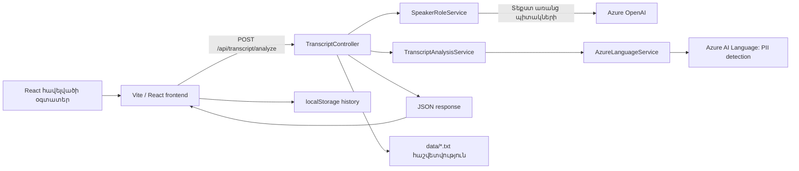

# Transcript Analysis

[English version](README.md) · [Русская версия](README.ru.md)

**Transcript Analysis**-ը լիարժեք վեբ հավելված է՝ անգլերեն և հայերեն հաճախորդների սպասարկման զանգերի տեքստային վերծանումները վերլուծելու համար։ Օգտատերը տեքստը տեղադրում է վեբ հավելվածում, backend-ը որոշում է երկխոսության հերթերը և արտածում անձը նույնականացնող տվյալներ (PII)։ Արդյունքը վերադարձվում է JSON ձևաչափով, ցուցադրվում է chat տեսքով, պահպանվում է բրաուզերի պատմության մեջ և API-ի կողմից նաև գրվում է տեղային հաշվետվության ֆայլում։

> **Կարևոր է․** նախագիծը մշակում է PII՝ անուններ, հասցեներ, հեռախոսահամարներ, email-ներ և ԱՄՆ Social Security համարներ։ Մի օգտագործեք իրական զգայուն տվյալներ ընդհանուր կամ չպաշտպանված զարգացման միջավայրում։ Azure-ի գաղտնաբառերը և ստեղծված հաշվետվությունները երբեք մի commit արեք Git-ում։

## Բովանդակություն

- [Հնարավորություններ](#հնարավորություններ)
- [Ճարտարապետություն և հարցման հոսք](#ճարտարապետություն-և-հարցման-հոսք)
- [Տեխնոլոգիաներ](#տեխնոլոգիաներ)
- [Repository-ի կառուցվածք](#repository-ի-կառուցվածք)
- [Նախապայմաններ](#նախապայմաններ)
- [Կարգավորում և գաղտնի տվյալներ](#կարգավորում-և-գաղտնի-տվյալներ)
- [Տեղային մեկնարկ](#տեղային-մեկնարկ)
- [Ինչպես է աշխատում վերլուծությունը](#ինչպես-է-աշխատում-վերլուծությունը)
- [API](#api)
- [Frontend-ի վարքագիծ](#frontend-ի-վարքագիծ)
- [Տվյալների պահպանում և գաղտնիություն](#տվյալների-պահպանում-և-գաղտնիություն)
- [Որակի ստուգումներ և թեստեր](#որակի-ստուգումներ-և-թեստեր)
- [Խնդիրների լուծում](#խնդիրների-լուծում)
- [Սահմանափակումներ և production առաջարկներ](#սահմանափակումներ-և-production-առաջարկներ)
- [Նախագծի փաստաթղթեր](#նախագծի-փաստաթղթեր)

## Հնարավորություններ

- Ընդունում է մինչև **50 000 նիշ** տեքստային վերծանումներ։
- Աջակցում է անգլերեն (`en`) և հայերեն (`hy`) մուտք։
- Azure AI Language-ով արտածում է PII-ի հինգ տեսակ՝ անուն, փոստային հասցե, ԱՄՆ SSN, հեռախոսահամար և email։
- Azure OpenAI-ով որոշում է `Agent` և `Caller` դերերը, երբ տեքստում բացահայտ խոսնակների պիտակներ չկան։
- Ճանաչում է անգլերեն և հայերեն խոսնակի պիտակներ․ պիտակավորված տեքստի համար դերերի Azure OpenAI կանչ չի կատարվում։
- Երկար տեքստը բաժանում է անվտանգ մասերի՝ Azure PII endpoint ուղարկելուց առաջ։
- Ցույց է տալիս երկխոսությունը chat bubbles-ով, իսկ տվյալները՝ պատճենվող card-ում։
- Բրաուզերի `localStorage`-ում պահպանում է 100 ամենավերջին հաջող վերլուծությունները։
- Յուրաքանչյուր հաջող API վերլուծության համար backend-ի `data/` թղթապանակում ստեղծում է UTF-8 տեքստային հաշվետվություն։
- Ներառում է Swagger UI Development միջավայրի համար և ավտոմատ .NET թեստեր։

## Ճարտարապետություն և հարցման հոսք



### Backend հոսք

1. `TranscriptController`-ը վավերացնում է հարցումը։
2. `SpeakerRoleService`-ը տեքստը դարձնում է երկխոսության հերթեր։
   - Եթե կան ճանաչված պիտակներ, այն հեռացնում է պիտակը և վերագրում համապատասխան դերը։
   - Եթե պիտակներ չկան, Azure OpenAI-ն որոշում է դերերը երկխոսության համատեքստից։
   - Եթե Azure OpenAI-ն հերթեր չի վերադարձրել, fallback-ը տողերով փոխարինում է `Speaker 1` և `Speaker 2`։
3. `TranscriptAnalysisService`-ը `AzureLanguageService`-ով փնտրում է PII։
4. Գտնված էությունները զտվում և կապվում են պատասխանի հինգ դաշտերին։
5. API-ն վերադարձնում է խոսակցությունը և ատրիբուտները, հետո փորձում է պահել տեղային հաշվետվություն։ Ֆայլ գրելու սխալը log է արվում, բայց հաջող API պատասխանը չի փոխվում։

## Տեխնոլոգիաներ

| Ոլորտ | Repository-ում օգտագործվող տեխնոլոգիաներ |
|---|---|
| Backend | ASP.NET Core Web API, C#, .NET 8 |
| Azure PII | `Azure.AI.TextAnalytics` 5.3.0 / Azure AI Language |
| Դերերի որոշում | `Azure.AI.OpenAI` 2.0.0, `OpenAI` 2.12.0, Responses API |
| API փաստաթղթեր | Swashbuckle / Swagger |
| Frontend հիմք | React 19.2, TypeScript 6, Vite 8 |
| UI | Ant Design 6, `@ant-design/icons`, `@emotion/styled`, Dayjs |
| Routing | React Router DOM 6 |
| Server state | TanStack React Query 5, Axios |
| Forms | React Hook Form, Yup, `@hookform/resolvers` |
| Frontend որակ | ESLint, Prettier, Husky, lint-staged |
| Թեստեր | xUnit, `Microsoft.AspNetCore.Mvc.Testing` |

Frontend-ը համապատասխանում է React 18+ պահանջին․ repository-ում տեղադրված է React 19.2։

## Repository-ի կառուցվածք

```text
.
├── Controllers/                      # POST endpoint, validation, error mapping, reports
├── Models/                           # request, response, PII և հերթերի DTO-ներ
├── Services/
│   ├── AzureLanguageService.cs       # Azure AI Language և chunking
│   ├── AzureOpenAIService.cs         # Azure OpenAI՝ դերերի համար
│   ├── TranscriptAnalysisService.cs  # PII filtering և mapping
│   └── SpeakerRoleService.cs          # պիտակներ և role orchestration
├── Resources/SpeakerRolePrompt.txt   # Azure OpenAI system prompt
├── Tests/TranscriptAnalysisTests.cs  # integration և chunking թեստեր
├── data/                             # տեղային հաշվետվություններ, Git-ը անտեսում է
├── docs/                             # API, հետազոտություններ և նշումներ
├── frontend/                         # առանձին Vite/React հավելված
├── Program.cs                        # DI և HTTP pipeline
├── appsettings.json                  # միայն placeholders
└── Task_2_TranscriptAnalysis.csproj
```

`frontend/src`-ում կան `api/` (Axios), `components/`, `hooks/` (React Query), `pages/`, `storage/history.ts` (localStorage), `types.ts`, `App.tsx` և `main.tsx`։

## Նախապայմաններ

- [.NET 8 SDK](https://dotnet.microsoft.com/download) կամ ավելի նոր;
- Node.js 20+ և npm;
- Azure AI Language resource՝ endpoint-ով և key-ով;
- Azure OpenAI resource, deploy արված model, endpoint և key։

Ներկայիս backend կարգավորման համար անհրաժեշտ են Azure-ի երկու ծառայություններն էլ։ Azure AI Language-ը արտածում է PII, իսկ Azure OpenAI-ն օգտագործվում է խոսնակի ճանաչված պիտակ չունեցող տեքստերի դեպքում։

## Կարգավորում և գաղտնի տվյալներ

`.env.example` և `appsettings.json` ֆայլերը պարունակում են միայն placeholders։ Իրական արժեքները պետք է պահվեն Git-ից դուրս։

### Առաջարկվող տարբերակ՝ .NET user secrets

Repository-ի արմատում գործարկեք հետևյալ հրամանները և փոխարինեք արժեքները ձերով․

```powershell
dotnet user-secrets set "AzureLanguageEndpoint" "https://<language-resource>.cognitiveservices.azure.com/"
dotnet user-secrets set "AzureLanguageKey" "<language-key>"
dotnet user-secrets set "AzureOpenAIEndpoint" "https://<openai-resource>.openai.azure.com/"
dotnet user-secrets set "AzureOpenAIKey" "<openai-key>"
dotnet user-secrets set "AzureOpenAIDeployment" "<deployment-name>"
```

`AzureOpenAIDeployment`-ը Azure-ում deployment-ի անունն է, ոչ թե պարզապես model family-ի անուն։ `appsettings.json`-ում placeholder-ը `gpt-5-mini` է։

### Environment variables

Container, CI/CD կամ hosting-ի համար օգտագործեք նույն key-երը environment variables-ում։ Ստանդարտ .NET configuration-ը դրանք կարդում է startup-ի պահին։ Գաղտնի տվյալներ մի ավելացրեք frontend source code-ում կամ `.env.example`-ում։

### Frontend API URL

Տեղային Vite development-ի ժամանակ `/api`-ը proxy է արվում `http://localhost:5266` հասցեին, հետևաբար փոփոխական պետք չէ։ Առանձին host-արված API-ի համար `frontend/.env.example`-ից ստեղծեք `frontend/.env`․

```powershell
Copy-Item frontend/.env.example frontend/.env
```

```dotenv
VITE_API_URL=https://your-api.example.com
```

Vite-ը browser code-ին փոխանցում է միայն `VITE_` նախածանց ունեցող փոփոխականները․ Azure key-եր այնտեղ երբեք մի պահեք։

## Տեղային մեկնարկ

Բացեք երկու terminal։

### 1. Backend

Repository-ի արմատում․

```powershell
dotnet restore
dotnet run --launch-profile http
```

HTTP profile-ը լսում է `http://localhost:5266` հասցեում։ Development-ում Swagger-ը հասանելի է [http://localhost:5266/swagger](http://localhost:5266/swagger) հասցեով։

HTTPS profile-ի համար․

```powershell
dotnet run --launch-profile https
```

Այն օգտագործում է `https://localhost:7027` և HTTP endpoint-ը։ Անհրաժեշտության դեպքում վստահեք .NET development certificate-ին։

### 2. Frontend

Երկրորդ terminal-ում․

```powershell
cd frontend
npm ci
npm run dev
```

Բացեք [http://localhost:3000](http://localhost:3000)։ Vite-ը `/api` հարցումները ուղղում է 5266 պորտում աշխատող backend-ին։

### 3. Օրինակ

```text
Agent: Hello, how can I help you?
Caller: My name is John Smith. My phone number is 555-123-4567.
```

Ընտրեք **English (en)** և սեղմեք **Analyze**։ Առաջին փորձի համար բացահայտ պիտակները հարմար են, քանի որ Azure OpenAI դերերի համար չի պահանջվի։

## Ինչպես է աշխատում վերլուծությունը

### Հարցման վավերացում

API-ն կտա `400 Bad Request`, եթե՝

- `transcriptText`-ը դատարկ է կամ միայն բացատներից է;
- տեքստը 50 000 նիշից երկար է;
- `language`-ը, առանց մեծ/փոքրատառի տարբերության, `en` կամ `hy` չէ;
- տեքստում կան English և Armenian Unicode միջակայքներից դուրս տառեր;
- ընտրված է English, բայց տեքստում կան հայերեն տառեր։

Հայերեն մուտքում անգլերեն տառերը նույնպես թույլատրվում են՝ օրինակ product name-երի կամ email-ի համար։

### Խոսնակի պիտակներ և դերեր

Ճանաչվող պիտակները մեծ/փոքրատառից կախված չեն․

| Մուտքային պիտակ | Պատասխանի դեր |
|---|---|
| `Agent:`, `Operator:`, `Օպերատոր:` | `Agent` |
| `Caller:`, `Customer:`, `Client:`, `Հաճախորդ:` | `Caller` |
| `Speaker 1:`, `Speaker 2:` | `Speaker 1`, `Speaker 2` |

Եթե գտնվել է թեկուզ մեկ ճանաչված պիտակ, ծառայությունը բոլոր տողերը parse է անում տեղային։ Չճանաչված պիտակով կամ առանց պիտակի տողը վերադարձվում է որպես `Speaker 1`․ ներկայիս implementation-ում այն **չի** միացվում ավտոմատ նախորդ պիտակավորված խոսնակին։

Եթե ճանաչված պիտակներ չկան, Azure OpenAI-ն ստանում է `Resources/SpeakerRolePrompt.txt` system prompt-ը և պետք է վերադարձնի JSON՝ `Agent` և `Caller` դերերով։ Եթե պատասխանը դատարկ է, fallback-ը տող առ տող հերթագայմամբ տալիս է `Speaker 1` և `Speaker 2`։

### PII և նորմալացում

Azure AI Language-ը վերադարձնում է category և confidence score ունեցող էություններ։ Ծառայությունը՝

- անտեսում է `0.5`-ից ցածր confidence ունեցող հայտնաբերումները;
- `Person`, `Address`, `USSocialSecurityNumber`, `PhoneNumber`, `Email` category-ները կապում է output model-ի դաշտերին;
- case-insensitive կերպով հեռացնում է կրկնությունները;
- նույն տեսակի մի քանի մնացած արժեքները միացնում է `, `-ով;
- չգտնված արժեքը վերադարձնում է JSON `null`, ոչ թե դատարկ տող;
- `^\d{3}-\d{2}-\d{4}$` pattern-ին համապատասխան `PhoneNumber`-ը վերաբերում է SSN-ի։ Սա ուղղում է Azure-ի հայտնի edge case-ը՝ առանձին ասված SSN-ի համար։

### Երկար տեքստեր

Azure synchronous PII API-ն ընդունում է առավելագույնը 5 120 նիշ մեկ document-ում և հինգ document մեկ batch request-ում։ `AzureLanguageService`-ը օգտագործում է 5 000 նիշանոց մասեր՝ նախընտրելով տողի սահմանները, և միանգամից ուղարկում է մինչև հինգ մաս։ Սահմանաչափից երկար մեկ տողը բաժանվում է միայն ծայրահեղ դեպքում։ Controller-ի 50 000 նիշի սահմանաչափն այսպես ապահովվում է Azure-ի մի քանի հարցմամբ։

Azure Language client-ի համար սահմանված է 20 վայրկյան network timeout, մինչև երկու retry, exponential retry mode և մեկ վայրկյան initial delay։

## API

Interactive OpenAPI documentation-ը `/swagger`-ում հասանելի է Development-ի ժամանակ։ Ավելի մանրամասն՝ [docs/ApiDocumentation.md](docs/ApiDocumentation.md)։

### `POST /api/transcript/analyze`

Header․

```http
Content-Type: application/json
```

Request․

```json
{
  "transcriptText": "Agent: Hello, how can I help you?\nCaller: My name is John Smith, my phone is 555-123-4567.",
  "language": "en"
}
```

Հաջող response (`200 OK`)․

```json
{
  "conversation": [
    { "role": "Agent", "text": "Hello, how can I help you?" },
    { "role": "Caller", "text": "My name is John Smith, my phone is 555-123-4567." }
  ],
  "extractedAttributes": {
    "name": "John Smith",
    "address": null,
    "socialSecurityNumber": null,
    "phoneNumber": "555-123-4567",
    "email": null
  }
}
```

| Status | Իմաստ |
|---|---|
| `200 OK` | Վերլուծությունը հաջողվել է։ |
| `400 Bad Request` | Սխալ է տեքստը, լեզուն, երկարությունը, այբուբենը կամ լեզու/տեքստ համընկնումը։ |
| `401 Unauthorized` | Azure AI Language-ը մերժել է key-ը։ |
| `503 Service Unavailable` | Azure AI Language-ը հասանելի չէ կամ ցանցային սխալ է եղել։ |
| `500 Internal Server Error` | Անսպասելի սխալ, ներառյալ առանձին չկապված սխալները։ |

Controller-ը վերադարձնում է պարզ տեքստային error message-ներ։ Exception-ները log են արվում server-ում, բայց key, endpoint և stack trace HTTP response-ում չեն տրվում։

## Frontend-ի վարքագիծ

| Route | Էջ | Վարքագիծ |
|---|---|---|
| `/` | New Transcription | Վավերացնում, ուղարկում է վերլուծության, ցույց է տալիս ու պահպանում արդյունքը։ |
| `/history` | History | Ցույց է տալիս տեղային պահպանված վերլուծությունները՝ նորից հին, և թույլ է տալիս ջնջել մեկը կամ բոլորը։ |
| `/transcription/:id` | Details | Ցույց է տալիս մեկ պահպանված վերլուծությունը, երկխոսությունը, ատրիբուտները և սկզբնական տեքստը։ |

### Տվյալներ և վիճակ

- Axios-ն օգտագործում է մեկ client՝ 60 վայրկյան timeout-ով։
- `useAnalyze`-ը React Query mutation է․ հաջողությունից հետո history-ին item է ավելացնում և invalidates history query-ը։
- `useHistory` և `useHistoryItem` React Query query-ներ են localStorage function-ների վրա։
- History item-ը պարունակում է UUID, ISO timestamp, սկզբնական request և հաջող response։
- Dayjs-ը ձևաչափում է history timestamp-երը։

### Form validation

React Hook Form-ը կառավարում է form-ը, իսկ Yup-ը այն ստուգում է ուղարկելուց առաջ։ Client-side կանոնները կրկնում են հիմնական backend կանոնները՝ պարտադիր տեքստ, 50 000 նիշ առավելագույն և `en` կամ `hy`։ Backend-ը մնում է validation-ի վերջնական հեղինակավոր շերտը։

## Տվյալների պահպանում և գաղտնիություն

Գոյություն ունի երկու անկախ պահպանման մեխանիզմ․

1. **Բրաուզերի պատմություն։** Frontend-ի հաջող վերլուծությունները ընթացիկ բրաուզերի `localStorage`-ում պահվում են `transcript_history_v1` key-ով։ Սահմանաչափը 100 item է։ Տվյալները չեն կիսվում այլ բրաուզերների կամ օգտատերերի հետ և կարելի է հեռացնել History էջից կամ բրաուզերի site-data settings-ից։
2. **Backend հաշվետվություններ։** Յուրաքանչյուր հաջող API հարցում փորձում է `data/`-ում UTF-8 `.txt` ֆայլ ստեղծել։ Այն ներառում է UTC ամսաթիվ, լեզու, PII, հայտնաբերված երկխոսություն և սկզբնական տեքստ։ File name-ում հնարավորության դեպքում օգտագործվում է մաքրված ու կրճատված հայտնաբերված անունը։

Root `.gitignore`-ը անտեսում է `data/` և `.env`։ Հաշվետվություններն ու browser data-ը համարեք զգայուն․ production տվյալներից առաջ կիրառեք access control, encryption, retention limits և deletion procedures։

## Որակի ստուգումներ և թեստեր

### Backend

```powershell
dotnet build
dotnet test
```

Թեստերը օգտագործում են `WebApplicationFactory<Program>` և `IAzureLanguageService`-ը փոխարինում են deterministic fake-ով։ Azure AI Language network call չի արվում և Language key պետք չէ։ Coverage-ում կան PII mapping, հայերեն պիտակներ, չգտնված ատրիբուտներ, invalid input, պիտակավորված երկխոսություններ, SSN reclassification և text chunking։

**Repository-ի ներկա կարգավիճակը․** `dotnet test`-ը գործարկում է 11 թեստ․ 10-ը անցնում է, 1-ը՝ ոչ՝ `Analyze_MixedLabelConversation_UnlabeledLineContinuesPreviousSpeaker`։ Թեստը ակնկալում է, որ մասամբ պիտակավորված երկխոսության պիտակ չունեցող տողը կպահպանի `Caller` դերը, սակայն ընթացիկ `SpeakerRoleService.ParseExplicitLabels`-ը դրան տալիս է `Speaker 1`։ Սա հայտնի code/test անհամապատասխանություն է, և թեստերի փաթեթն այժմ ամբողջովին green չէ։

### Frontend

```powershell
cd frontend
npm run lint
npm run build
npm run format
```

- `lint`-ը գործարկում է ESLint։
- `build`-ը կատարում է TypeScript type-check և ստեղծում է production bundle-ը `frontend/dist`-ում։
- `format`-ը Prettier-ով վերագրում է աջակցվող ֆայլերը։

Husky pre-commit hook-ը `frontend`-ից գործարկում է `npx lint-staged`՝ ESLint fixes և Prettier կիրառելով միայն աջակցվող staged file-ների նկատմամբ։

## Խնդիրների լուծում

| Նշան | Հավանական պատճառ և լուծում |
|---|---|
| Backend-ը չի սկսվում՝ `AzureLanguageEndpoint` կամ `AzureLanguageKey` not configured | Սահմանեք երկու արժեքն էլ `dotnet user-secrets` կամ environment variables-ով։ |
| Առանց պիտակների տեքստի վերլուծությունը վերադարձնում է `500` | Կարգավորեք Azure OpenAI-ի բոլոր երեք արժեքները։ Պիտակավորված տեքստը role inference չի պահանջում, բայց backend-ին Azure OpenAI անհրաժեշտ է առանց պիտակների տեքստի համար։ |
| Browser-ում “Cannot reach the backend” | Գործարկեք backend-ը, ստուգեք `http://localhost:5266`, հետո `VITE_API_URL` կամ Vite proxy-ը։ |
| API-ն վերադարձրել է `401 Unauthorized` | Ստուգեք Azure AI Language endpoint/key-ը․ դրանք պետք է նույն resource-ին պատկանեն։ |
| API-ն վերադարձրել է `503 Service Unavailable` | Ստուգեք ցանցը և Azure-ի հասանելիությունը․ Language client-ը երկու անգամ կրկնում է անհաջող հարցումը։ |
| Swagger-ը չկա | Գործարկեք Development-ում․ Swagger-ը միացված է միայն `ASPNETCORE_ENVIRONMENT=Development` դեպքում։ |
| `dotnet test`-ում մեկ failed test կա | Տես վերևում նկարագրված mixed-label test անհամապատասխանությունը։ Green CI-ից առաջ ծառայությունն ու թեստը համապատասխանեցրեք ցանկալի կանոնին։ |
| Vite-ը զգուշացնում է chunk > 500 kB-ի մասին | Production build-ը հիմա մեծ bundle է ստեղծում։ Production-ի համար դիտարկեք route-level lazy loading կամ manual chunks։ |

## Սահմանափակումներ և production առաջարկներ

- PII-ի ճշգրտությունն ու հասանելի entity type-երը կախված են Azure AI Language-ից․ վարքագիծը փորձարկեք ներկայացուցչական, համաձայնությամբ ստացված տվյալների վրա։
- Առանց պիտակների տեքստի դերերը կախված են Azure OpenAI response-ից։ Այն կարող է դանդաղ լինել, գումար արժենալ և սխալվել, ուստի կարևոր արդյունքները մարդը պետք է ստուգի։
- Հավելվածում չկան authentication, authorization, user management, database, audit trail կամ server-side history API։
- Ընթացիկ `Program.cs`-ը explicit CORS policy չի սահմանում։ Առանձին host-ավորված browser frontend-ի production-ից առաջ սահմանեք թույլատրելի origins-ները։
- Հաշվետվությունները պահպանվում են որպես չգաղտնագրված plaintext files։ Production-ում փոխարինեք կամ պաշտպանեք այս մեխանիզմը։
- Իրական տվյալների մշակումից առաջ ավելացրեք rate limits, structured monitoring, secret rotation, secure logging/redaction, retention, backup և deletion workflows։
- Deployment-ի ժամանակ համոզվեք, որ `Resources/SpeakerRolePrompt.txt`-ը հասանելի է․ `.csproj`-ը այն copy է անում output։

## Նախագծի փաստաթղթեր

| Ֆայլ | Նպատակ |
|---|---|
| [docs/ApiDocumentation.md](docs/ApiDocumentation.md) | Endpoint contract և օրինակներ։ |
| [docs/TestResults.md](docs/TestResults.md) | Ավտոմատ և live-service test notes։ |
| [docs/Azure_PII_NER_Endpoint_Research.md](docs/Azure_PII_NER_Endpoint_Research.md) | Azure PII/NER հետազոտություն։ |
| [docs/speaker-roles.md](docs/speaker-roles.md) | Խոսնակի դերերի նշումներ։ |
| [docs/frontend.txt](docs/frontend.txt) | Frontend architecture և ուսումնական նշումներ։ |
| [docs/Member1.md](docs/Member1.md)–[docs/Member5.md](docs/Member5.md) | Թիմի presentation և implementation notes։ |

Որոշ պատմական փաստաթղթեր նկարագրում են ավելի վաղ role-detection կամ deployment ենթադրություններ։ Այս README-ն նկարագրում է repository-ի ընթացիկ source code-ը․ հակասության դեպքում առաջնորդվեք կոդով։
