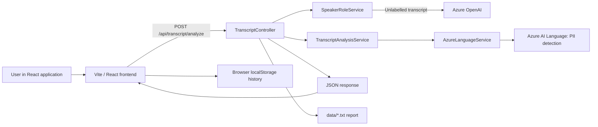

# Transcript Analysis

[Русская версия](README.ru.md) · [Հայերեն տարբերակ](README.hy.md)

Transcript Analysis is a full-stack application for analysing customer-service call transcripts in English and Armenian. A user pastes a transcript into the web application; the backend identifies the conversation turns and extracts personally identifiable information (PII). The result is returned as JSON, rendered as a chat-style conversation, saved in the browser history, and also written to a local report file by the API.

> **Important:** This project processes PII, including names, addresses, phone numbers, email addresses, and US Social Security numbers. Do not use real sensitive data in a shared or non-secure development environment. Never commit Azure credentials or generated reports to source control.

## Contents

- [Features](#features)
- [Architecture and request flow](#architecture-and-request-flow)
- [Technology stack](#technology-stack)
- [Repository structure](#repository-structure)
- [Prerequisites](#prerequisites)
- [Configuration and secrets](#configuration-and-secrets)
- [Run locally](#run-locally)
- [How the analysis works](#how-the-analysis-works)
- [API reference](#api-reference)
- [Frontend behaviour](#frontend-behaviour)
- [Data storage and privacy](#data-storage-and-privacy)
- [Quality checks and tests](#quality-checks-and-tests)
- [Troubleshooting](#troubleshooting)
- [Limitations and production recommendations](#limitations-and-production-recommendations)
- [Project documentation](#project-documentation)

## Features

- Accepts plain-text call transcripts up to **50,000 characters**.
- Supports English (`en`) and Armenian (`hy`) input.
- Extracts five PII attributes through Azure AI Language:
  - person name;
  - postal address;
  - US Social Security Number (SSN);
  - phone number;
  - email address.
- Uses Azure OpenAI to infer `Agent` and `Caller` roles for transcripts without explicit speaker labels.
- Recognises explicit English and Armenian speaker labels, so labelled transcripts do not require an Azure OpenAI role-detection call.
- Splits long text into safe chunks before calling the Azure PII endpoint.
- Displays the conversation as chat bubbles and attributes in a copyable card.
- Keeps the most recent 100 successful analyses in browser `localStorage`.
- Writes a UTF-8 text report for each successful API analysis into the backend `data/` directory.
- Includes Swagger UI in the Development environment and automated .NET tests.

## Architecture and request flow



### Backend flow

1. `TranscriptController` validates the request.
2. `SpeakerRoleService` turns the transcript into conversation turns.
   - When it finds recognised labels, it removes the label and maps it to a role.
   - When no labels are present, it asks Azure OpenAI to infer the roles from the dialogue context.
   - If Azure OpenAI returns no turns, it falls back to `Speaker 1` / `Speaker 2` by alternating lines.
3. `TranscriptAnalysisService` asks `AzureLanguageService` to detect PII.
4. The PII entities are filtered and mapped to the five response fields.
5. The API returns the conversation and extracted attributes, then attempts to save a local text report. A report-writing failure is logged but does not change a successful API response.

## Technology stack

| Area | Technologies used in this repository |
|---|---|
| Backend | ASP.NET Core Web API, C#, .NET 8 |
| Azure PII | `Azure.AI.TextAnalytics` 5.3.0 / Azure AI Language |
| Azure role inference | `Azure.AI.OpenAI` 2.0.0, `OpenAI` 2.12.0, Responses API |
| API documentation | Swashbuckle / Swagger |
| Frontend core | React 19.2, TypeScript 6, Vite 8 |
| UI | Ant Design 6, `@ant-design/icons`, `@emotion/styled`, Dayjs |
| Routing | React Router DOM 6 |
| Server state | TanStack React Query 5, Axios |
| Forms | React Hook Form, Yup and `@hookform/resolvers` |
| Frontend quality | ESLint, Prettier, Husky, lint-staged |
| Tests | xUnit and `Microsoft.AspNetCore.Mvc.Testing` |

The frontend satisfies the requested React 18+ requirement; the installed version is React 19.2.

## Repository structure

```text
.
├── Controllers/
│   └── TranscriptController.cs       # POST endpoint, validation, error mapping, report writing
├── Models/                           # Request, response, PII and conversation DTOs
├── Services/
│   ├── AzureLanguageService.cs       # Azure AI Language client and text chunking
│   ├── AzureOpenAIService.cs         # Azure OpenAI role-inference client
│   ├── TranscriptAnalysisService.cs  # PII filtering and field mapping
│   └── SpeakerRoleService.cs          # Label parsing and role-detection orchestration
├── Resources/
│   └── SpeakerRolePrompt.txt          # System prompt for Azure OpenAI
├── Tests/
│   └── TranscriptAnalysisTests.cs     # API integration tests and chunking test
├── data/                             # Generated local reports; ignored by Git
├── docs/                             # API, testing, research and project notes
├── frontend/
│   ├── src/api/                      # Axios client and endpoint call
│   ├── src/components/               # Layout, form, chat view and attributes card
│   ├── src/hooks/                    # React Query hooks
│   ├── src/pages/                    # New analysis, history and details routes
│   └── src/storage/history.ts         # Browser localStorage persistence
├── Program.cs                        # Dependency injection and HTTP pipeline
├── appsettings.json                  # Placeholder configuration only
└── Task_2_TranscriptAnalysis.csproj
```

## Prerequisites

- [.NET 8 SDK](https://dotnet.microsoft.com/download) or later;
- Node.js 20+ and npm;
- an Azure AI Language resource with a valid endpoint and key;
- an Azure OpenAI resource, a deployed model, its endpoint and key.

Both Azure services are required for the current backend configuration. Azure AI Language performs PII extraction. Azure OpenAI is used whenever an input transcript has no recognised speaker labels.

## Configuration and secrets

The repository provides placeholders in `.env.example` and `appsettings.json`. Real values must be provided outside Git.

### Recommended local configuration: .NET user secrets

Run the following commands at the repository root. Replace the values with your own Azure resource values.

```powershell
dotnet user-secrets set "AzureLanguageEndpoint" "https://<language-resource>.cognitiveservices.azure.com/"
dotnet user-secrets set "AzureLanguageKey" "<language-key>"
dotnet user-secrets set "AzureOpenAIEndpoint" "https://<openai-resource>.openai.azure.com/"
dotnet user-secrets set "AzureOpenAIKey" "<openai-key>"
dotnet user-secrets set "AzureOpenAIDeployment" "<deployment-name>"
```

`AzureOpenAIDeployment` must be the Azure deployment name, not merely a public model-family name. The default placeholder in `appsettings.json` is `gpt-5-mini`.

### Environment variables

For a container, CI/CD system, or hosted service, use the same configuration keys as environment variables. The standard .NET configuration provider reads them at startup. Do not place secrets in frontend source code or `.env.example`.

### Frontend API URL

During local Vite development, the frontend proxies `/api` to `http://localhost:5266`, so no frontend variable is necessary. To call a separately hosted API, create `frontend/.env` from the example:

```powershell
Copy-Item frontend/.env.example frontend/.env
```

Set the value in `frontend/.env`:

```dotenv
VITE_API_URL=https://your-api.example.com
```

Vite exposes only variables beginning with `VITE_` to browser code. Therefore, never add Azure keys there.

## Run locally

Open two terminals.

### 1. Start the backend

From the repository root:

```powershell
dotnet restore
dotnet run --launch-profile http
```

The HTTP profile listens on `http://localhost:5266`. In Development, Swagger is available at [http://localhost:5266/swagger](http://localhost:5266/swagger).

You may use the HTTPS launch profile instead:

```powershell
dotnet run --launch-profile https
```

It uses `https://localhost:7027` as well as the HTTP endpoint. Trust the .NET development certificate if your machine requests it.

### 2. Start the frontend

From a second terminal:

```powershell
cd frontend
npm ci
npm run dev
```

Open [http://localhost:3000](http://localhost:3000). The Vite development server proxies requests beginning with `/api` to the backend at port 5266.

### 3. Try a sample transcript

```text
Agent: Hello, how can I help you?
Caller: My name is John Smith. My phone number is 555-123-4567.
```

Choose **English (en)** and select **Analyze**. Explicit labels make this a convenient first test because speaker roles do not need Azure OpenAI inference.

## How the analysis works

### Request validation

The API rejects a request with `400 Bad Request` if:

- `transcriptText` is empty or whitespace;
- the transcript is longer than 50,000 characters;
- `language` is not `en` or `hy` (case-insensitive);
- the text contains letters outside English and Armenian Unicode ranges;
- English is selected but the text contains Armenian letters.

Armenian input may also contain English letters, which supports mixed text such as product names or email addresses.

### Speaker labels and roles

Recognised labels are case-insensitive:

| Input label | Returned role |
|---|---|
| `Agent:`, `Operator:`, `Օպերատոր:` | `Agent` |
| `Caller:`, `Customer:`, `Client:`, `Հաճախորդ:` | `Caller` |
| `Speaker 1:`, `Speaker 2:` | `Speaker 1`, `Speaker 2` |

If at least one recognised label exists, the service parses each line locally. A line without a recognised label is returned as `Speaker 1`; it is **not** automatically attached to the preceding labelled speaker in the current implementation.

When no recognised labels exist, Azure OpenAI receives the system prompt in `Resources/SpeakerRolePrompt.txt` and is asked to return JSON conversation turns with `Agent` and `Caller` roles. If it returns an empty result, the fallback alternates `Speaker 1` and `Speaker 2` by line.

### PII detection and normalization

Azure AI Language returns entities with a category and confidence score. The service:

- ignores detections with confidence below `0.5`;
- maps `Person`, `Address`, `USSocialSecurityNumber`, `PhoneNumber`, and `Email` to the output model;
- removes duplicate values case-insensitively;
- joins multiple remaining values of the same category with `, `;
- keeps missing values as JSON `null`, not an empty string;
- reclassifies a `PhoneNumber` matching `^\d{3}-\d{2}-\d{4}$` as an SSN. This handles a documented Azure classification edge case for standalone SSNs.

### Long transcripts

Azure's synchronous PII API accepts at most 5,120 characters per document and five documents per batch request. `AzureLanguageService` uses 5,000-character chunks, preferring line boundaries, then sends up to five chunks at a time. A single line exceeding that length is split as a last resort. The controller-level 50,000-character limit is therefore supported by multiple Azure requests.

The Azure Language client has a 20-second network timeout, up to two retries, exponential retry mode, and a one-second initial delay.

## API reference

Interactive OpenAPI documentation is available at `/swagger` in Development. More details are in [docs/ApiDocumentation.md](docs/ApiDocumentation.md).

### `POST /api/transcript/analyze`

Headers:

```http
Content-Type: application/json
```

Request:

```json
{
  "transcriptText": "Agent: Hello, how can I help you?\nCaller: My name is John Smith, my phone is 555-123-4567.",
  "language": "en"
}
```

Successful response (`200 OK`):

```json
{
  "conversation": [
    { "role": "Agent", "text": "Hello, how can I help you?" },
    { "role": "Caller", "text": "My name is John Smith, my phone is 555-123-4567." }
  ],
  "extractedAttributes": {
    "name": "John Smith",
    "address": null,
    "socialSecurityNumber": null,
    "phoneNumber": "555-123-4567",
    "email": null
  }
}
```

| Status | Meaning |
|---|---|
| `200 OK` | Analysis succeeded. |
| `400 Bad Request` | Invalid text, language, length, alphabet, or language/text mismatch. |
| `401 Unauthorized` | Azure AI Language key was rejected. |
| `503 Service Unavailable` | Azure AI Language is unavailable or a network request failed. |
| `500 Internal Server Error` | An unexpected error occurred, including failures not specifically mapped above. |

The controller returns plain-text error messages. It logs server-side exceptions but does not expose keys, endpoints, or stack traces in the HTTP response.

## Frontend behaviour

The frontend contains three routes:

| Route | Page | Behaviour |
|---|---|---|
| `/` | New Transcription | Validates input, submits analysis, shows the result, and saves it to history. |
| `/history` | History | Lists locally saved analyses, newest first; allows deleting one or clearing all. |
| `/transcription/:id` | Details | Displays one saved analysis, conversation, attributes, and original transcript. |

### Data and state

- Axios uses one configured client with a 60-second timeout.
- `useAnalyze` is a React Query mutation. On success it adds an item to local history and invalidates the history query.
- `useHistory` and `useHistoryItem` are React Query queries over localStorage-backed functions.
- The local history item has a UUID, ISO timestamp, original request and successful response.
- Dayjs formats history timestamps.

### Form validation

React Hook Form manages the form and Yup validates it before sending. The client-side rules mirror the backend's basic rules: required transcript, 50,000-character maximum, and `en` or `hy`. The backend remains the authoritative validation layer.

## Data storage and privacy

Two independent persistence mechanisms exist:

1. **Browser history:** successful frontend analyses are stored under `transcript_history_v1` in the current browser's `localStorage`. The limit is 100 items. This data is not shared with other browsers or users and can be removed from the History page or through browser site-data settings.
2. **Backend reports:** every successful API request attempts to create a UTF-8 `.txt` report in `data/`. The file contains the date in UTC, language, extracted PII, detected conversation and original transcript. Its filename uses a sanitized, shortened detected name where possible.

The root `.gitignore` ignores `data/` and `.env`. Treat report files and browser data as sensitive. Apply access controls, encryption, retention limits and data-deletion procedures before using this application with production data.

## Quality checks and tests

### Backend

```powershell
dotnet build
dotnet test
```

The tests use `WebApplicationFactory<Program>` and replace `IAzureLanguageService` with a deterministic fake. They do not make Azure AI Language network calls or require a Language key. Coverage includes PII mapping, Armenian labels, missing attributes, invalid input, labelled conversations, SSN reclassification and text chunking.

**Current repository status:** `dotnet test` runs 11 tests; 10 pass and one currently fails: `Analyze_MixedLabelConversation_UnlabeledLineContinuesPreviousSpeaker`. The test expects an unlabelled line in a partially labelled transcript to inherit `Caller`, while the current `SpeakerRoleService.ParseExplicitLabels` assigns it `Speaker 1`. This is a known code/test mismatch, not a successful test suite.

### Frontend

```powershell
cd frontend
npm run lint
npm run build
npm run format
```

- `lint` runs ESLint.
- `build` type-checks with TypeScript and creates the production bundle in `frontend/dist`.
- `format` rewrites supported files with Prettier.

The Husky pre-commit hook runs `npx lint-staged` from `frontend`, applying ESLint fixes and Prettier only to staged supported files.

## Troubleshooting

| Symptom | Likely cause and resolution |
|---|---|
| Backend fails at startup with `AzureLanguageEndpoint` or `AzureLanguageKey` not configured | Set both values with `dotnet user-secrets` or environment variables. |
| Analysis of an unlabelled transcript returns `500` | Configure all three Azure OpenAI values. Explicitly labelled transcripts avoid role inference, but the backend still requires Azure OpenAI for unlabelled input. |
| Browser shows “Cannot reach the backend” | Start the backend, verify `http://localhost:5266`, then verify `VITE_API_URL` or the Vite proxy configuration. |
| `401 Unauthorized` from API | Check the Azure AI Language endpoint/key pair and ensure they belong to the same resource. |
| `503 Service Unavailable` | Check network connectivity and Azure service availability; the Language client retries a failed request twice. |
| Swagger is unavailable | Run in the Development environment; Swagger registration is only enabled when `ASPNETCORE_ENVIRONMENT=Development`. |
| `dotnet test` has one failed mixed-label test | See the documented code/test mismatch above. Update the service or test according to the desired rule before treating the suite as green. |
| Vite warns about a chunk larger than 500 kB | The production build currently packages a large frontend bundle. Consider route-level lazy loading or manual chunks for a production optimization. |

## Limitations and production recommendations

- PII recognition quality and supported entity types are determined by Azure AI Language; validate behaviour on representative, consented data.
- Role inference for unlabelled transcripts depends on an Azure OpenAI model response. It can be slower, cost money, and may make mistakes; review high-risk outputs.
- The application has no authentication, authorization, user management, database, audit trail or server-side history API.
- Current `Program.cs` does not configure an explicit CORS policy. Configure allowed production origins before serving a separately hosted browser frontend.
- Reports are stored as unencrypted plaintext files. Replace or secure this mechanism for production.
- Add rate limits, structured monitoring, secret rotation, secure logging/redaction, retention policies, backup and deletion workflows before handling real customer data.
- Ensure a deployment supplies `Resources/SpeakerRolePrompt.txt`; it is copied to the build output by the project file.

## Project documentation

| File | Purpose |
|---|---|
| [docs/ApiDocumentation.md](docs/ApiDocumentation.md) | Endpoint contract and examples. |
| [docs/TestResults.md](docs/TestResults.md) | Automated and live-service test notes. |
| [docs/Azure_PII_NER_Endpoint_Research.md](docs/Azure_PII_NER_Endpoint_Research.md) | Azure PII/NER research. |
| [docs/speaker-roles.md](docs/speaker-roles.md) | Speaker-role notes. |
| [docs/frontend.txt](docs/frontend.txt) | Frontend architecture and learning notes. |
| [docs/Member1.md](docs/Member1.md) through [docs/Member5.md](docs/Member5.md) | Team presentation and implementation notes. |

Some historical documents describe earlier role-detection or deployment assumptions. This README describes the current source code in the repository; refer to the code when a historical note conflicts with it.
