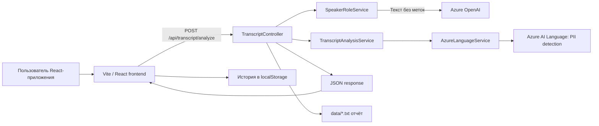

# Transcript Analysis

[English version](README.md) · [Հայերեն տարբերակ](README.hy.md)

**Transcript Analysis** — полнофункциональное приложение для анализа транскрипций звонков в службу поддержки на английском и армянском языках. Пользователь вставляет транскрипцию в веб-приложение; backend определяет реплики диалога и извлекает персональные данные (PII). Результат возвращается в JSON, отображается как чат, сохраняется в истории браузера и дополнительно записывается API в локальный файл-отчёт.

> **Важно:** проект обрабатывает персональные данные: имена, адреса, телефоны, email и номера Social Security США. Не используйте реальные чувствительные данные в общей или небезопасной среде разработки. Никогда не коммитьте Azure credentials и созданные отчёты в Git.

## Содержание

- [Возможности](#возможности)
- [Архитектура и поток запроса](#архитектура-и-поток-запроса)
- [Технологии](#технологии)
- [Структура репозитория](#структура-репозитория)
- [Предварительные требования](#предварительные-требования)
- [Настройка и секреты](#настройка-и-секреты)
- [Локальный запуск](#локальный-запуск)
- [Как работает анализ](#как-работает-анализ)
- [API](#api)
- [Поведение frontend](#поведение-frontend)
- [Хранение данных и конфиденциальность](#хранение-данных-и-конфиденциальность)
- [Проверки качества и тесты](#проверки-качества-и-тесты)
- [Устранение неполадок](#устранение-неполадок)
- [Ограничения и рекомендации для production](#ограничения-и-рекомендации-для-production)
- [Документация проекта](#документация-проекта)

## Возможности

- Принимает текстовые транскрипции до **50 000 символов**.
- Поддерживает английский (`en`) и армянский (`hy`).
- Извлекает через Azure AI Language пять типов PII: имя, почтовый адрес, US SSN, номер телефона и email.
- Использует Azure OpenAI для определения ролей `Agent` и `Caller`, если в транскрипции нет явных меток говорящих.
- Распознаёт английские и армянские метки говорящих; в размеченном тексте Azure OpenAI для ролей не вызывается.
- Безопасно разбивает длинный текст на части перед запросом в Azure PII.
- Показывает диалог пузырями чата и данные в карточке, откуда значения можно скопировать.
- Хранит 100 последних успешных анализов в `localStorage` браузера.
- Создаёт UTF-8 текстовый отчёт для каждого успешного API-анализа в директории backend `data/`.
- Содержит Swagger UI для Development и автоматические .NET-тесты.

## Архитектура и поток запроса



### Поток backend

1. `TranscriptController` валидирует запрос.
2. `SpeakerRoleService` превращает текст в реплики диалога.
   - При наличии распознанных меток сервис удаляет метку и сопоставляет ей роль.
   - При отсутствии меток Azure OpenAI определяет роли по контексту диалога.
   - Если Azure OpenAI не вернул реплики, сервис по строкам чередует `Speaker 1` и `Speaker 2`.
3. `TranscriptAnalysisService` вызывает `AzureLanguageService` для поиска PII.
4. Найденные сущности фильтруются и сопоставляются с пятью полями ответа.
5. API возвращает разговор и атрибуты, затем пытается сохранить локальный отчёт. Ошибка записи логируется, но не меняет успешный ответ API.

## Технологии

| Область | Используемые в репозитории технологии |
|---|---|
| Backend | ASP.NET Core Web API, C#, .NET 8 |
| Azure PII | `Azure.AI.TextAnalytics` 5.3.0 / Azure AI Language |
| Определение ролей | `Azure.AI.OpenAI` 2.0.0, `OpenAI` 2.12.0, Responses API |
| API-документация | Swashbuckle / Swagger |
| Основа frontend | React 19.2, TypeScript 6, Vite 8 |
| UI | Ant Design 6, `@ant-design/icons`, `@emotion/styled`, Dayjs |
| Маршрутизация | React Router DOM 6 |
| Состояние сервера | TanStack React Query 5, Axios |
| Формы | React Hook Form, Yup, `@hookform/resolvers` |
| Качество frontend | ESLint, Prettier, Husky, lint-staged |
| Тесты | xUnit, `Microsoft.AspNetCore.Mvc.Testing` |

Frontend соответствует требованию React 18+; в репозитории установлена React 19.2.

## Структура репозитория

```text
.
├── Controllers/                      # POST endpoint, validation, error mapping, reports
├── Models/                           # DTO запроса, ответа, PII и реплик
├── Services/
│   ├── AzureLanguageService.cs       # Azure AI Language и chunking
│   ├── AzureOpenAIService.cs         # Azure OpenAI для ролей
│   ├── TranscriptAnalysisService.cs  # фильтрация и mapping PII
│   └── SpeakerRoleService.cs          # метки и orchestration ролей
├── Resources/SpeakerRolePrompt.txt   # system prompt Azure OpenAI
├── Tests/TranscriptAnalysisTests.cs  # integration и chunking tests
├── data/                             # локальные отчёты, игнорируются Git
├── docs/                             # API, исследования и заметки
├── frontend/                         # отдельное Vite/React приложение
├── Program.cs                        # DI и HTTP pipeline
├── appsettings.json                  # только placeholders
└── Task_2_TranscriptAnalysis.csproj
```

В `frontend/src` находятся: `api/` (Axios), `components/`, `hooks/` (React Query), `pages/`, `storage/history.ts` (localStorage), `types.ts`, `App.tsx` и `main.tsx`.

## Предварительные требования

- [.NET 8 SDK](https://dotnet.microsoft.com/download) или новее;
- Node.js 20+ и npm;
- Azure AI Language resource с endpoint и key;
- Azure OpenAI resource, развёрнутая модель, endpoint и key.

Оба Azure-сервиса необходимы для текущей конфигурации backend. Azure AI Language извлекает PII; Azure OpenAI используется для текстов без распознанных меток говорящих.

## Настройка и секреты

`.env.example` и `appsettings.json` содержат только placeholders. Реальные значения должны быть вне Git.

### Рекомендуемый способ: .NET user secrets

Выполните в корне репозитория и замените значения на свои:

```powershell
dotnet user-secrets set "AzureLanguageEndpoint" "https://<language-resource>.cognitiveservices.azure.com/"
dotnet user-secrets set "AzureLanguageKey" "<language-key>"
dotnet user-secrets set "AzureOpenAIEndpoint" "https://<openai-resource>.openai.azure.com/"
dotnet user-secrets set "AzureOpenAIKey" "<openai-key>"
dotnet user-secrets set "AzureOpenAIDeployment" "<deployment-name>"
```

`AzureOpenAIDeployment` — это имя deployment в Azure, а не просто имя семейства модели. Placeholder в `appsettings.json` — `gpt-5-mini`.

### Environment variables

Для контейнера, CI/CD или хостинга используйте те же ключи в environment variables. Стандартная конфигурация .NET считывает их при запуске. Не добавляйте секреты в frontend-код или `.env.example`.

### URL API для frontend

При локальной разработке Vite проксирует `/api` на `http://localhost:5266`, поэтому переменная не требуется. Для отдельного API создайте `frontend/.env` из примера:

```powershell
Copy-Item frontend/.env.example frontend/.env
```

```dotenv
VITE_API_URL=https://your-api.example.com
```

В браузер Vite передаёт только переменные с префиксом `VITE_`, поэтому Azure keys там хранить нельзя.

## Локальный запуск

Откройте два терминала.

### 1. Backend

В корне репозитория:

```powershell
dotnet restore
dotnet run --launch-profile http
```

HTTP-профиль запускается на `http://localhost:5266`. В Development Swagger доступен по адресу [http://localhost:5266/swagger](http://localhost:5266/swagger).

HTTPS-профиль:

```powershell
dotnet run --launch-profile https
```

Он использует `https://localhost:7027` и HTTP endpoint. При необходимости подтвердите доверие к .NET development certificate.

### 2. Frontend

Во втором терминале:

```powershell
cd frontend
npm ci
npm run dev
```

Откройте [http://localhost:3000](http://localhost:3000). Vite перенаправляет запросы `/api` на backend, работающий на порту 5266.

### 3. Пример

```text
Agent: Hello, how can I help you?
Caller: My name is John Smith. My phone number is 555-123-4567.
```

Выберите **English (en)** и нажмите **Analyze**. Явные метки удобны для первой проверки: Azure OpenAI для ролей не понадобится.

## Как работает анализ

### Валидация запроса

API вернёт `400 Bad Request`, если:

- `transcriptText` пустой или состоит из пробелов;
- текст длиннее 50 000 символов;
- `language` не равен `en` или `hy` без учёта регистра;
- в тексте есть буквы вне диапазонов English и Armenian Unicode;
- выбран English, но текст содержит армянские буквы.

Для армянского допускаются также английские буквы: это поддерживает, например, названия продуктов и email.

### Метки и роли говорящих

Распознаваемые метки не чувствительны к регистру:

| Метка во входном тексте | Роль в ответе |
|---|---|
| `Agent:`, `Operator:`, `Օպերատոր:` | `Agent` |
| `Caller:`, `Customer:`, `Client:`, `Հաճախորդ:` | `Caller` |
| `Speaker 1:`, `Speaker 2:` | `Speaker 1`, `Speaker 2` |

Если найдена хотя бы одна метка, сервис разбирает все строки локально. Строка без распознанной метки возвращается как `Speaker 1`; в текущем коде она **не** присоединяется автоматически к предыдущему размеченному говорящему.

Если распознанных меток нет, Azure OpenAI получает system prompt из `Resources/SpeakerRolePrompt.txt` и должен вернуть JSON с ролями `Agent` и `Caller`. Если ответ пустой, fallback чередует `Speaker 1` и `Speaker 2` по строкам.

### PII и нормализация

Azure AI Language возвращает сущности с категорией и confidence score. Сервис:

- игнорирует confidence ниже `0.5`;
- сопоставляет `Person`, `Address`, `USSocialSecurityNumber`, `PhoneNumber`, `Email` с полями модели;
- удаляет дубликаты без учёта регистра;
- объединяет несколько оставшихся значений одного типа через `, `;
- возвращает отсутствующее значение как JSON `null`, а не пустую строку;
- распознаёт `PhoneNumber`, соответствующий `^\d{3}-\d{2}-\d{4}$`, как SSN. Это исправляет известный крайний случай классификации Azure для отдельно произнесённого SSN.

### Длинные тексты

Синхронный Azure PII API принимает максимум 5 120 символов в документе и пять документов в batch-запросе. `AzureLanguageService` использует части по 5 000 символов, предпочитая границы строк, и отправляет до пяти частей одновременно. Одна строка сверх лимита разбивается только в крайнем случае. Лимит контроллера 50 000 символов поддерживается несколькими запросами Azure.

Для Azure Language client настроены network timeout 20 секунд, максимум две повторные попытки, экспоненциальный retry и начальная задержка одна секунда.

## API

Интерактивная OpenAPI-документация есть в `/swagger` при Development. Дополнительно: [docs/ApiDocumentation.md](docs/ApiDocumentation.md).

### `POST /api/transcript/analyze`

Заголовок:

```http
Content-Type: application/json
```

Запрос:

```json
{
  "transcriptText": "Agent: Hello, how can I help you?\nCaller: My name is John Smith, my phone is 555-123-4567.",
  "language": "en"
}
```

Успешный ответ (`200 OK`):

```json
{
  "conversation": [
    { "role": "Agent", "text": "Hello, how can I help you?" },
    { "role": "Caller", "text": "My name is John Smith, my phone is 555-123-4567." }
  ],
  "extractedAttributes": {
    "name": "John Smith",
    "address": null,
    "socialSecurityNumber": null,
    "phoneNumber": "555-123-4567",
    "email": null
  }
}
```

| Status | Значение |
|---|---|
| `200 OK` | Анализ выполнен. |
| `400 Bad Request` | Некорректны текст, язык, длина, алфавит или соответствие языка тексту. |
| `401 Unauthorized` | Azure AI Language отклонил key. |
| `503 Service Unavailable` | Azure AI Language недоступен или произошла сетевая ошибка. |
| `500 Internal Server Error` | Неожиданная ошибка, включая ошибки, не сопоставленные отдельно. |

Контроллер возвращает простые текстовые сообщения. Исключения логируются на сервере, но key, endpoint и stack trace в HTTP-ответ не включаются.

## Поведение frontend

| Route | Страница | Поведение |
|---|---|---|
| `/` | New Transcription | Валидирует текст, запускает анализ, показывает результат и сохраняет его. |
| `/history` | History | Выводит сохранённые анализы от новых к старым; можно удалить один или все. |
| `/transcription/:id` | Details | Показывает один сохранённый анализ, диалог, атрибуты и исходный текст. |

### Данные и состояние

- Axios использует один client с timeout 60 секунд.
- `useAnalyze` — React Query mutation; после успеха добавляет элемент в history и invalidates history query.
- `useHistory` и `useHistoryItem` — React Query queries над функциями localStorage.
- History item содержит UUID, ISO timestamp, исходный request и успешный response.
- Dayjs форматирует timestamp в истории.

### Валидация формы

React Hook Form управляет формой, а Yup проверяет её до отправки. Client-side правила повторяют основные backend-правила: обязательный текст, максимум 50 000 символов, `en` или `hy`. Backend остаётся единственным авторитетным уровнем валидации.

## Хранение данных и конфиденциальность

Есть два независимых механизма хранения:

1. **История браузера.** Успешные анализы frontend хранятся под ключом `transcript_history_v1` в `localStorage` текущего браузера. Лимит — 100 элементов. Данные не делятся между браузерами или пользователями и удаляются со страницы History либо через настройки данных сайта браузера.
2. **Отчёты backend.** Каждый успешный API-запрос пытается создать UTF-8 файл `.txt` в `data/`. В нём есть UTC-дата, язык, PII, найденный диалог и исходная транскрипция. В имени файла по возможности используется очищенное и сокращённое найденное имя.

Root `.gitignore` игнорирует `data/` и `.env`. Считайте отчёты и данные браузера чувствительными; перед работой с production-данными добавьте access control, encryption, retention limits и процедуры удаления.

## Проверки качества и тесты

### Backend

```powershell
dotnet build
dotnet test
```

Тесты используют `WebApplicationFactory<Program>` и заменяют `IAzureLanguageService` детерминированным fake. Они не делают сетевых вызовов Azure AI Language и не требуют Language key. Покрыты mapping PII, армянские метки, отсутствующие атрибуты, неверный ввод, размеченные диалоги, SSN reclassification и text chunking.

**Текущий статус репозитория:** `dotnet test` запускает 11 тестов; 10 проходят, 1 не проходит: `Analyze_MixedLabelConversation_UnlabeledLineContinuesPreviousSpeaker`. Тест ждёт, что строка без метки в частично размеченном диалоге сохранит роль `Caller`, а текущий `SpeakerRoleService.ParseExplicitLabels` назначает ей `Speaker 1`. Это известное расхождение кода и теста, поэтому набор тестов сейчас не полностью зелёный.

### Frontend

```powershell
cd frontend
npm run lint
npm run build
npm run format
```

- `lint` запускает ESLint.
- `build` выполняет TypeScript type-check и создаёт production bundle в `frontend/dist`.
- `format` перезаписывает поддерживаемые файлы через Prettier.

Husky pre-commit hook запускает `npx lint-staged` из `frontend`, применяя ESLint fixes и Prettier только к поддерживаемым staged-файлам.

## Устранение неполадок

| Симптом | Вероятная причина и решение |
|---|---|
| Backend не запускается: `AzureLanguageEndpoint` или `AzureLanguageKey` not configured | Настройте оба значения через `dotnet user-secrets` или environment variables. |
| Анализ текста без меток возвращает `500` | Настройте все три значения Azure OpenAI. Размеченный текст не требует role inference, но Azure OpenAI нужен backend для текстов без меток. |
| Браузер пишет “Cannot reach the backend” | Запустите backend, проверьте `http://localhost:5266`, затем `VITE_API_URL` или Vite proxy. |
| API вернул `401 Unauthorized` | Проверьте endpoint/key Azure AI Language — они должны относиться к одному resource. |
| API вернул `503 Service Unavailable` | Проверьте сеть и доступность Azure; Language client повторяет неудачный запрос два раза. |
| Swagger отсутствует | Запускайте в Development: Swagger включён только при `ASPNETCORE_ENVIRONMENT=Development`. |
| В `dotnet test` один failed test | См. описанное выше расхождение mixed-label test. Перед зелёным CI синхронизируйте сервис и тест с нужным правилом. |
| Vite предупреждает о chunk > 500 kB | Production build сейчас формирует большой bundle. Для production рассмотрите route-level lazy loading или manual chunks. |

## Ограничения и рекомендации для production

- Точность PII и доступные типы сущностей зависят от Azure AI Language; проверьте поведение на репрезентативных данных с согласием пользователей.
- Роли в тексте без меток зависят от ответа Azure OpenAI. Это может занимать время, стоить денег и ошибаться; важные результаты должны проверяться человеком.
- В приложении нет authentication, authorization, пользователей, базы данных, audit trail или server-side history API.
- Текущий `Program.cs` не задаёт явную CORS policy. До отдельного hosting frontend настройте разрешённые production origins.
- Отчёты сохраняются как незашифрованные plaintext-файлы. Для production замените или защитите этот механизм.
- До работы с реальными данными добавьте rate limits, structured monitoring, secret rotation, secure logging/redaction, retention, backup и deletion workflows.
- При deployment убедитесь, что `Resources/SpeakerRolePrompt.txt` доступен: `.csproj` копирует его в output.

## Документация проекта

| Файл | Назначение |
|---|---|
| [docs/ApiDocumentation.md](docs/ApiDocumentation.md) | Контракт endpoint и примеры. |
| [docs/TestResults.md](docs/TestResults.md) | Заметки по автоматическим и live-service тестам. |
| [docs/Azure_PII_NER_Endpoint_Research.md](docs/Azure_PII_NER_Endpoint_Research.md) | Исследование Azure PII/NER. |
| [docs/speaker-roles.md](docs/speaker-roles.md) | Заметки о ролях говорящих. |
| [docs/frontend.txt](docs/frontend.txt) | Архитектура и учебные заметки по frontend. |
| [docs/Member1.md](docs/Member1.md)–[docs/Member5.md](docs/Member5.md) | Командные презентационные и implementation notes. |

Некоторые исторические документы описывают более ранние предположения о ролях или deployment. Этот README описывает текущий исходный код репозитория; при противоречии ориентируйтесь на код.
